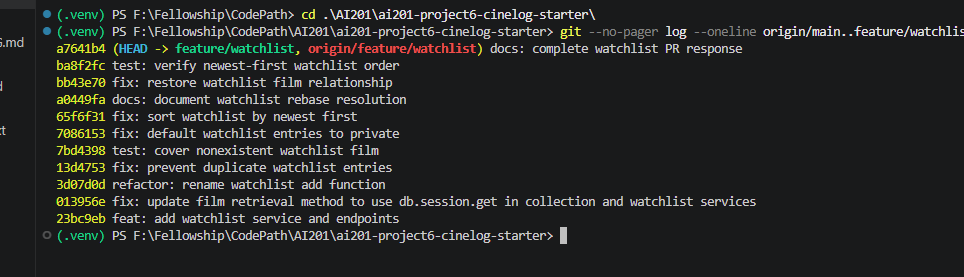

# PR Response Doc — CineLog Watchlist Feature

## AI Usage

I used AI to help orient me to the unfamiliar repository, locate the original
review after my fork omitted the feature branch, and explain how the existing
collection service and tests establish CineLog's patterns. I verified those
explanations against the source code. I also used AI as a devil's advocate for
Comments 4 and 5 by asking what a careful reviewer would challenge and which
tradeoffs my draft omitted. AI raised reduced community discovery under a
private default and harder known-title lookup under newest-first ordering. I
kept my original positions, but revised my response to acknowledge those costs
and explain why consent and recent activity still take priority in CineLog.

## Comment 1 — Rename

**What I did:**

I renamed `save_to_watchlist()` to `add_to_watchlist()` in
`services/watchlist_service.py` so it follows CineLog's `verb_to_noun` service
naming convention. I also updated the import and call in
`routes/watchlist/watchlist.py`.

**How I verified:**

I used a project-wide search for `save_to_watchlist` before the change to find
the definition and its one call site. After renaming both, I repeated the search
to confirm no references to the old name remained, then ran the full test suite.

## Comment 2 — Deduplication

**What I did:**

I followed `add_to_collection()`'s existing pattern: query `WatchlistEntry` by
both `user_id` and `film_id` before inserting, and raise a new
`AlreadyInWatchlistError` when that pair already exists. The watchlist route
catches that domain error and returns HTTP 409, matching the collection API's
conflict behavior.

**How I verified:**

I added the same film for the same user twice in an isolated in-memory database.
The second call raised `AlreadyInWatchlistError`, and the database still
contained exactly one matching entry. I also ran the full test suite to check
for regressions.

## Comment 3 — Missing test

**What I did:**

I created `tests/test_watchlist.py` and added
`test_add_to_watchlist_nonexistent_film_raises()`. It confirms that the service
raises `FilmNotFoundError` before attempting to create a database entry when the
film does not exist.

**How I verified:**

I modeled the fixtures, application-context boundary, fake ID, and
`pytest.raises` assertion on
`test_add_to_collection_nonexistent_film_raises()` in
`tests/test_collection.py`. I ran the watchlist test file by itself and then the
full suite.

## Comment 4 — Default visibility

**My position:**

New watchlist entries should default to private. A user may explicitly make an
entry public, where public means visible to CineLog's community generally—not
shared with a specific watcher. Per-viewer permissions are outside the simple
public/private model and would add access-control complexity that this feature
does not need.

**Reasoning:**

A watchlist captures viewing intentions, which users may reasonably treat as
personal until they choose to share them. A private default prevents accidental
exposure and makes publication an intentional act. This still supports CineLog's
community focus because users can opt entries into discovery, but it does not
assume that every saved film is meant for an audience. I changed the model
default from `public=True` to `public=False` so the implementation matches this
decision.

**Tradeoff acknowledged:**

Public-by-default would create more recommendations and social discovery with
less effort from users. Private-by-default may therefore reduce the amount of
watchlist activity visible to the community, especially if users never change
the setting. I accept that cost because explicit consent is more important than
maximizing passive sharing; a clear visibility control can reduce the added
friction without introducing viewer-specific permissions.

## Comment 5 — Sort order

**My position:**

I agree with the maintainer that the default should be date-added order, with
the newest entry first. I replaced alphabetical title ordering with descending
`WatchlistEntry.date_added` ordering.

**Reasoning:**

A watchlist records a user's recent intention to watch something. Showing the
newest additions first helps users return to films they just discovered or
saved. It also matches `get_collection()`, which already returns newest-added
films first, so CineLog's two personal film lists have a predictable default.

**Engagement with reviewer's point:**

The maintainer's claim that users commonly want to see recent additions fits
both the purpose of a watchlist and CineLog's established collection behavior.
Alphabetical order does have an advantage: it is easier to scan for a known
title in a long list. I do not think that lookup case should control the default,
because search or a future optional sort parameter can serve it without hiding
recent activity. Newest-first is therefore the better default, while
alphabetical ordering remains a reasonable future caller-selected option. I
verified this behavior with an additional test that creates entries at two
different times and asserts that the newer film appears first.

## Comment 6 — Rebase

**What conflicted:**

I fetched the fork and ran `git rebase origin/main`. The first conflict was an
add/add conflict in `.gitignore` because both branches had independently added
the file. The substantive conflict was in `models.py`: updated `main` had
migrated `Film.id` and `CollectionEntry.film_id` to UUID strings, while the
watchlist feature still defined `WatchlistEntry.film_id` as an integer.

**How I resolved it:**

For `.gitignore`, I kept `main`'s complete generated-file rules, including
`.pytest_cache/`. For `models.py`, I retained `main`'s UUID definitions and
restored `WatchlistEntry` with `film_id` as `db.String(36)` referencing
`film.id`. I also changed the watchlist service documentation and route example
from integer IDs to UUID strings and replaced the test's fake integer with a
well-formed nonexistent UUID.

**How I verified no conflict remains:**

I searched the project for conflict markers and remaining integer `film_id`
references, then ran `pytest tests/ -v`; all five tests passed. I confirmed that
`origin/main` is an ancestor of the feature branch and that
`git log --merges origin/main..HEAD` returns no feature-branch merge commits.

## PR Description

### What this feature does

This PR adds a separate watchlist for films a user intends to watch, including
service logic and `GET /watchlist/<user_id>` and
`POST /watchlist/<user_id>/add` endpoints. Adding a missing film fails with a
domain error, while adding the same film twice returns HTTP 409 instead of
creating a duplicate.

### Design decisions

Watchlist entries default to private so sharing is intentional; visibility is a
simple public/private choice rather than a viewer-specific permission system.
Watchlists are returned by date added, newest first, to prioritize recent
viewing intentions and remain consistent with CineLog's collection ordering.

### Manual testing

1. Create and activate a virtual environment, then run
   `pip install -r requirements.txt`.
2. Run `python app.py` and leave the API running at `http://127.0.0.1:5000`.
3. In a separate Python shell using the same project, enter an application
   context, create one `User` and two `Film` records, commit them, and note their
   UUIDs.
4. Send `POST /watchlist/<user_uuid>/add` with JSON
   `{ "film_id": "<first_film_uuid>" }`; confirm HTTP 201 and
   `"public": false` in the returned entry.
5. Repeat the same request; confirm HTTP 409 and that no duplicate is created.
6. Add the second film, then send `GET /watchlist/<user_uuid>`; confirm both
   films are returned with the most recently added film first.
7. Run `pytest tests/ -v`; confirm the full suite passes.

## Git History Evidence

